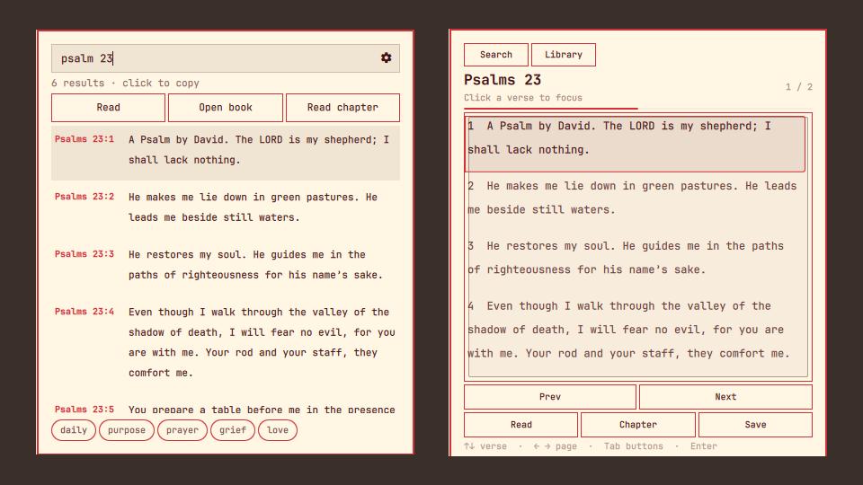

# Bible Search

The whole World English Bible in your Omarchy bar, fully offline. Search any word, phrase, or reference, copy a verse with one click, and read or listen to the chapter without leaving the panel.



- **Search** all 31,098 verses by word, phrase, or reference (`john 3:16`, `psalm 23`, `shepherd`).
- **Copy** any verse to the clipboard by clicking it.
- **Daily verse** on open, plus topic shortcuts.
- **Reader** with paged or scrolling chapters, a book library, and Saved and Recent passages.
- **Read aloud** with read-along highlighting, using a voice already on your machine.
- **Keyboard driven**: arrows, Tab, Enter, and Esc cover everything.
- **Private**: no network requests, no account, no API key. The text ships with the plugin.

## Install

```sh
omarchy plugin add https://github.com/dl-alexandre/omarchy-bible-search.git --enable
omarchy plugin enable dev.alexandre.bible-search --section right
omarchy restart shell
```

QML does not apply until that restart.

## Remove

```sh
omarchy plugin remove dev.alexandre.bible-search
```

## Voice

Reading aloud stays on the machine. The panel already uses whatever local engine it finds, in this order:

1. Optional Piper neural voice (plugin-local install, Settings → Neural).
2. Whatever is already on `PATH`: `espeak-ng`, `espeak`, `spd-say` (speech-dispatcher), or `flite`. Settings → System uses this.
3. `BIBLE_TTS_BIN` — path or command name of your own CLI. It must accept `tool -- TEXT` like espeak, unless it is `spd-say` or `flite`.

There is no GPU reader and no shipped ELF.

## CLI

```sh
bin/omarchy-bible-search search "John 3:16"
bin/omarchy-bible-search chapter "John 3"
bin/omarchy-bible-search daily
bin/omarchy-bible-search doctor
bin/omarchy-bible-search voice-status
bin/omarchy-bible-search read GEN 1:1
bin/omarchy-bible-search speak "In the beginning"
```

In the bar: type to search, click a result to copy, **Daily** for today’s verse, **Book** to read that chapter in the overlay (Esc returns to search).

Search uses ripgrep when available, otherwise `grep`. Daily is `day-of-year % verse-count`.

## Data

Bundled public-domain World English Bible (WEBP) in `data/books/`. There is no download or installer path.

## License

MIT for the code. The World English Bible text is in the public domain.

## Tests

```sh
bash -n bin/omarchy-bible-search
bash tests/test-bible-search.sh
```
